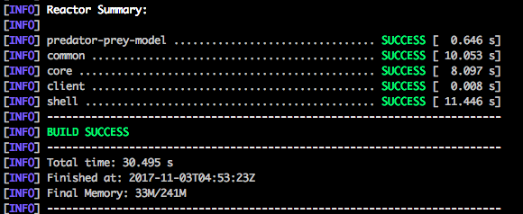
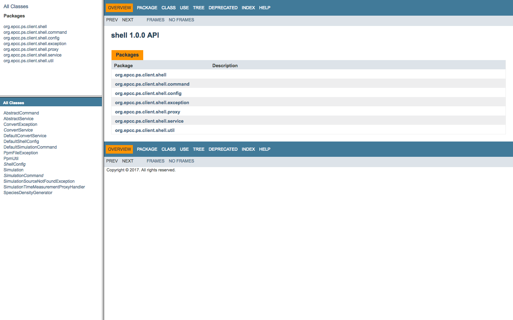
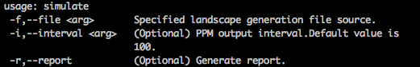
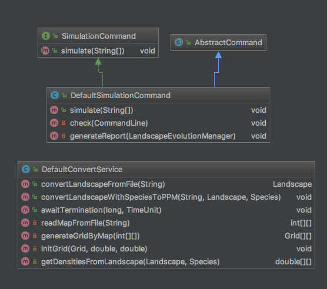

Predator-Prey Model
===================

## Introduction
This project implements a sequential version of a two-dimensional predator-prey model with spatial diffusion.

## Technology Explained
__Language__: This project is mainly developed using Java with Java version 1.8.0_73.Java HotSpot(TM) 64-Bit Server VM (build 25.73-b02, mixed mode) is used as target JVM.The [Google Java Code Style Guide](https://google.github.io/styleguide/javaguide.html) is followed for development.

__Revision Control__: Git is used for revision control and Github is used to maintain the repository.The repository can be found [there](https://github.com/Yiiinsh/predator-prey-model).We follow the Github Flow, as is described in [https://guides.github.com/introduction/flow/](https://guides.github.com/introduction/flow/), during our development. 

__Debuggers__: IDE embeded debugger for Intellij IDEA is used for debug.

__Build Tool__: This project use maven as build tool.Maven version is 3.5.2.

__Test Tool__: JUnit framework with version 4.11 is used as our test framework.Mockito 2.11.0 is used as mocking framework for unit testing.

__Optimization__: Jconsole and Jstat is used to detect Garbage Collection and Memory Usage for optimization.

__Continuous Integration__: Travis CI is introduced for continuous integration.Build status:

__Coverage__: Coveralls is introduced for coverage report.Results:

__Liscense__: This project is licensed under [Apache 2 License](https://github.com/Yiiinsh/predator-prey-model/blob/master/LICENSE).Details:

## Prerequisite
To get, build and install this project,following dependencies is required:

* __git v2.15.0__: To get source code from Github.
* __java v1.8.0_73__: Project basic working environment.
* __maven v3.5.2__: Build tools.

Note that previous version of these depenencies may also work fine, but we are not guaranteed about that.

## Build
### Get Source
Before we take to next step, you need to set up a Github account first.We assume that you have already obtained a Github account. To get the source code of this project, you need to open your terminal and using:
        
        git clone https://github.com/Yiiinsh/predator-prey-model.git

Normally, a directory named "predator-pery-model" that contains the source code will appear under your current working directory. Or you can also fetch the source code by download it.

### Build
To build this project, firstly you need to change your current working directory to the directory you just cloned ("predator-prey-model").Open your terminal and type :

    mvn clean install

Maven will automatically install all the dependencies and run our test.If you see a success message from your terminal, you have successfully build our project.

### Javadoc
Javadoc can automatically generate a API documentation for this project in HTML format. To get this API documentation, you can type the following command on your terminal

    mvn javadoc:javadoc

After execution, you will be able to find the documentation in __target/site/apidocs/__ under every module directory.Example for documentation got from __client/shell/target/site/apidocs/__ is shown below

## Usage
### Basic
After you have successfully build our project, you can find executables in **client/shell/target/shell-1.0.0-simulation/shell-1.0.0/** . We have provided a startup script named simulation.sh which you can find in the same directory.You can either invoke by the shell script __./simulation.sh__ with flags or by __java -jar  client/shell/target/shell-1.0.0-simulation/shell-1.0.0/simulation.jar__ with flags.Command provided by our program is shown below:

* -f or --file \<arg\> : This is a mandatory argument that specify the source file to generate the landscape for evolution.
* -i or --interval \<arg\> : This is a optional argument.Value for this flag declare a interval for output of both PPM files and average numbers of hare and puma.Default value for this option is 100.
* -r or --report : This is a option flag.If the flag is used, there will be a html report generated after execution.Average densities for hare and puma will be demonstrated using a line chart.If the size of landscape is less than 10 * 10 , there will be a dynamic simulation demonstration represented. You need a connection to the network to see the full source of this report.

### Output
After execution, corresponding plain PPM file will appear in current working directory.Average densities and total execution time over given interval will be presented on both of the terminal output and a file named __simulation.log__. You can also check the trends of densities over evolutions on the generated report __report.html__ (network required).

## Test
This project use JUnit and Mocktio for testing. Unit test is defined for every individual part in our project.Coverage reaches 79% accroding to Coveralls. To execute the test, you can type the command below and test result will appear after execution.

    mvn test -B

To execute single test, you can open our project with IDE such as Intellij IDEA or Eclipese which provided a more convenient test execution environment.

Further tests have been taken to check the performance of our program using landscape size 3\*3, 20\*20, 50\*50, 100\*100, 500\*500, 1000\*1000, 1500\*1500 and 2000\*2000.Results are illustrated below:

| size 	| time/ms 	|
|------	|:---------:|
| 3    	| 169     	|
| 20   	| 281     	|
| 50   	| 451     	|
| 100  	| 884     	|
| 500  	| 12745   	|
| 1000 	| 44070   	|
| 1500 	| 89313   	|
| 2000 	| 157748  	|

Sample output for __simulation.sh -f file2000.dat -i 100__ are shown as:

## Source Code Layout
The predator-prey-model is the root directory of this project.Root directory contains a pom.xml file for maven build. It defines three modules in this project :

### common
Common module defines some general purpose tool for this project. In our project, it contains the definition of base configuration class which is used for manipulating the configurations in this project.And a base exception class which can be modified in a more general way for further consideration.

Corresponding test is attached to check the correctness of Config class.

### core
Core module contains the core alghrithm implementation for this project together with some classes for better modeling.We extract the landscape as a Landscape class with Gird as a single unit inside the landscape.Grid class keeps the information about densities of hare and puma.Corresponding factory classes are provided to create instances of Landscape and Grid. A EvolutionManager class is designed to help perform and tracking the evolution status. It include a evolution method to perfrom the evolution and records the results and average densities for every evolution. The equation of this project is defined inside DefaultCoreAlghrithm class to help perform the evolution.

Corresponding test is attached to check the correctness of classes defined in core module.

### client
Client module contains the user interface for this project.For now, we only provide a CLI client for user to perform the simulation via command line.The CLI client is implemented in shell module inside client module.Shell module contains use SimulationCommand class to process the command parsing and simulation execution.ConvertService class is used to convert data for IO.Dynamic design pattern is used to measure the execution time for the simulation.We use Java reflection to achieve this goal and SimulationTimeMeasurementProxyHandler class is the dynamic handler for time measurement.

Corresponding test is attached to check the correctness of command and service execution.

## Design
We are using Java to implement this project so we take a more object oriented way to model this problem.

The landscape for our problem is modeled as Landscape class. A two dimensional array of Grid class is used to model the units of landscape.Grid class has a Terrain member which is implemented by a Enum class to identify the type of this grid. Densities for hare and puma are recorded as a double member. Species for identifing puma and hare together with there equation attributes are implemented as a Species enum class. We can use Species class as a key to get current density from Grid.

LandscapeEvolutionManager class is designed to perform the evolution. It contains the Landscape for evolution. It keep tracks of densities for every species on every evolutions. If the landscape is within a specified scale (in this case, 10 * 10 is used) , LandscapeEvolutionManager will maintain snap shots for every evolution which can be used to generate the dynamic evolution simpulation part in the report.

For the client part, we use a command-service model to implement the CLI.

Class Diagram are presented below:

## More
Some famous Java thrid-party libraries are used in this project including :

* Apache Commons Configuration2 : Generic configuration interface for Java
* Log4j2 : Logging tools for Java
* Apache Commons-Cli : Apache commons library for command line options processing
* Velocity : Java based template engine for static resources generation

## Key Design Decision
Since we are using Java to implement this project, we would like to model it in a more object oriented way. It is obvious to model the landscape as Landscape class and map grid inside landscape to a 2 dimensional Grid class array.

### Memory Usage Diagnosis
We map species such as hare and puma as a Species enum class for scalability and 
understandability. There is a problem occurs for the storage of densities of species inside a Grid.  Firstly, we use a __Map<Sepcies, Double>__ and initialized it with EnumMap to store the densities of different species inside a grid. When we test our program with 2000 * 2000 landscape, the program runs very slow. We then use the jconsole and jstat tools to check the runtime JVM information and it shows that there are lots of minorGC during execution and it costs about 1 minutes to do the garbage collection.

We analyzed the result and got the conclusion that there is an ineffeciency of object storage in our code. We use Intellij IDE embeded debugger to set up break points and use method __ObjectSizeCalculator.getObjectSize(Object object)__ to check the memory usage of our objects. It shows that Grid object takes much memory. The main reason for this is the usage of EnumMap. It takes more than 6000 byte to store two densities data. We then decided to use a two dimensional double array to store the densities and use the ordinal value for enum Species to fetch the corresponding density. Memory used by a double[2] is aboult 32 byte in our test machine and it is a significantly reduce in the object size of Grid. Good performance was got after the modification.

### JVM Optimization
The code contains lots of ephemeral objects over every evolutions and the usage of old generation in JVM is rarely altered. After tests on different scenarios, we decided to allocate more space for JVM new generation. We use the option __"-Xms4g -Xmx4g -Xmn2g"__ for our test machine.

### Implementation
We implemented our CLI module by command-service pattern where command arranges tasks and assign specific jobs for services and managers to do for decouple purpose. Defensive programming strategy is used to prevent unknown user behaviour. Single Responsibility Principle matters a lot through our development process. We used a interface based programming in our service implementations.

## Contributor
[@Shaohan Yin](https://github.com/Yiiinsh)

[@Jiahao Cao](https://github.com/JasonCao666)

## License
This project is licensed under the [Apache 2 License](https://github.com/Yiiinsh/predator-prey-model/blob/master/LICENSE)